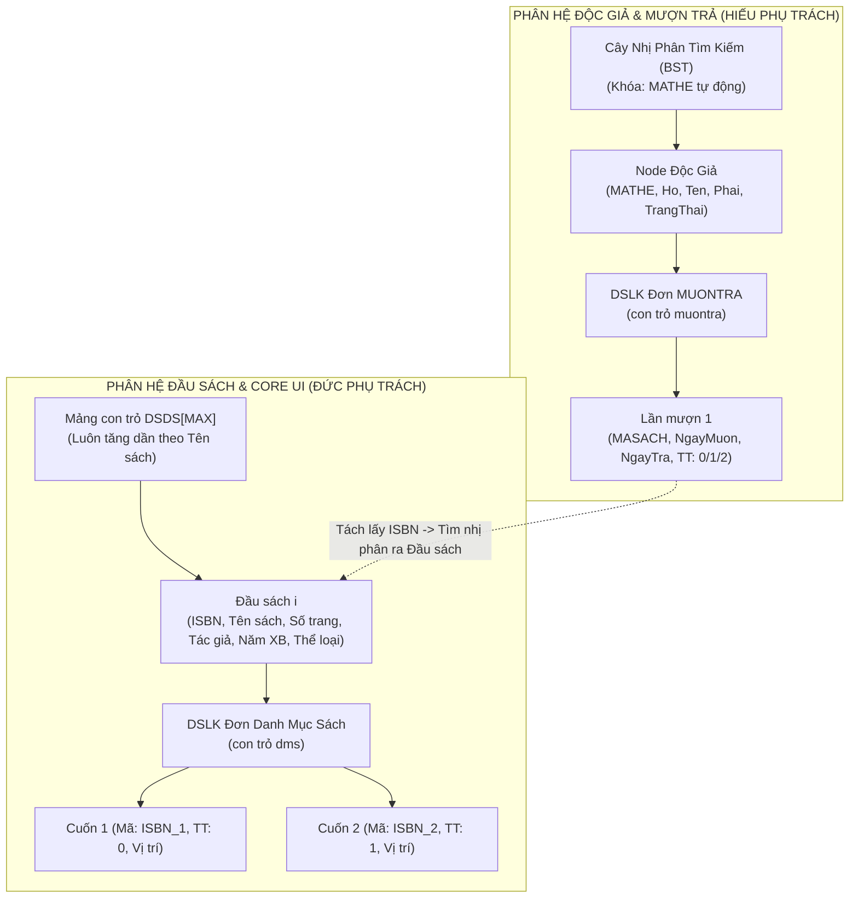
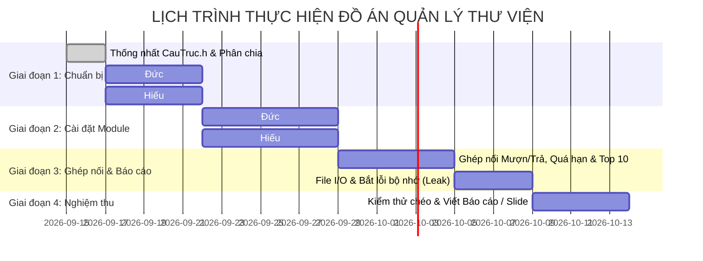

# KẾ HOẠCH PHÂN CHIA CÔNG VIỆC ĐỒ ÁN CUỐI KỲ
## MÔN: CẤU TRÚC DỮ LIỆU & GIẢI THUẬT (C++)
### ĐỀ TÀI 3: QUẢN LÝ THƯ VIỆN

---

## 1. THÔNG TIN CHUNG
- **Đề tài**: Quản lý Thư viện sách.
- **Ngôn ngữ**: C++ (Chuẩn C++11 trở lên, lập trình cấu trúc dữ liệu thuần với con trỏ và cấp phát động, không dùng thư viện container có sẵn như `std::vector`, `std::list`, `std::map` để đảm bảo chuẩn yêu cầu môn học).
- **Thành viên nhóm**:
  1. **Hiếu** (Thành viên 1 - Trưởng nhóm)
  2. **Đức** (Thành viên 2)
- **Mục tiêu**:
  - Phân chia công việc công bằng 50/50, rõ ràng ranh giới nghiệp vụ, hai bạn có thể code độc lập song song mà không bị nghẽn tiến độ.
  - Cả hai thành viên đều cài đặt các cấu trúc dữ liệu cốt lõi và nâng cao (Cây BST, Mảng con trỏ, DSLK đơn) để tự tin bảo vệ vấn đáp đạt điểm tối đa (9.5 - 10.0).

---

## 2. PHÂN TÍCH 4 CẤU TRÚC DỮ LIỆU & RÀNG BUỘC KỸ THUẬT



---

## 3. BẢNG PHÂN CHIA NHIỆM VỤ CHI TIẾT (50 / 50)

### 3.1. THÀNH VIÊN 1: HIẾU
> **Trọng tâm**: Quản lý Cây BST Độc giả, Danh sách liên kết Mượn Trả & Toàn bộ Logic Giao dịch Mượn/Trả/Quá hạn.

| STT | Hạng mục công việc | Yêu cầu kỹ thuật & Giải thuật | Trọng số & Sản phẩm |
| :---: | :--- | :--- | :---: |
| **H1** | **Cấu trúc Dữ liệu Độc giả & Mượn trả** | • Cài đặt Cây BST cho Thẻ độc giả (`TheDocGia`, `TREE_DocGia`).<br>• Cài đặt DSLK đơn cho Mượn Trả (`MuonTra`, `NodeMuonTra`). | `DocGia.h`<br>`MuonTra.h` |
| **H2** | **Chức năng (a) - Quản lý Thẻ Độc Giả** | • **Thêm thẻ**: Tự động sinh `MATHE` (số nguyên ngẫu nhiên/tuần tự không trùng với thẻ cũ), Phái chỉ nhận `'Nam'` hoặc `'Nữ'`, Trạng thái = 1 (hoạt động). Thêm node vào cây BST.<br>• **Hiệu chỉnh thẻ**: Tìm theo `MATHE`, sửa Họ, Tên, Phái, Trạng thái (khóa/mở).<br>• **Xóa thẻ**: Cài đặt chuẩn thuật toán xóa node trên cây BST (xóa node lá, node 1 con, node 2 con tìm node thế mạng). Ràng buộc: Không cho xóa thẻ nếu độc giả đang mượn sách chưa trả. | `DocGia.cpp` |
| **H3** | **Chức năng (b) - In danh sách độc giả** | • **Chế độ 1**: In theo `MATHE` tăng dần $\rightarrow$ Duyệt cây BST theo thứ tự LNR (In-order traversal).<br>• **Chế độ 2**: In theo Tên + Họ tăng dần $\rightarrow$ Duyệt cây nạp vào mảng con trỏ phụ, viết thuật toán sắp xếp (QuickSort hoặc MergeSort) theo Tên, nếu trùng tên thì so sánh Họ. | `DocGia.cpp` |
| **H4** | **Chức năng (f) - Nghiệp vụ Mượn Sách** | • Nhập `MATHE` $\rightarrow$ Liệt kê các sách đang mượn.<br>• **Kiểm tra 3 điều kiện**: (1) Thẻ đang hoạt động (`TrangThai == 1`), (2) Số lượng sách đang mượn $< 3$ cuốn, (3) Không có cuốn nào mượn quá 7 ngày.<br>• Nếu đủ điều kiện $\rightarrow$ Cho nhập `MASACH`, kiểm tra sách có `TrangThai == 0` (cho mượn được) không $\rightarrow$ Thêm vào DSLK Mượn Trả, cập nhật trạng thái cuốn sách bên DMS thành `1` (đã mượn). | `MuonTra.cpp` |
| **H5** | **Chức năng (g) - Nghiệp vụ Trả Sách / Mất Sách** | • Nhập `MATHE` và `MASACH`.<br>• Cập nhật `NgayTra` = ngày hiện tại.<br>• Nếu trả sách $\rightarrow$ đổi trạng thái mượn trả thành `1`, cập nhật trạng thái cuốn sách bên DMS về `0`.<br>• Nếu làm mất sách $\rightarrow$ đổi trạng thái mượn trả thành `2`, cập nhật trạng thái cuốn sách bên DMS thành `2` (thanh lý). | `MuonTra.cpp` |
| **H6** | **Chức năng (h) - Liệt kê sách độc giả đang mượn** | • Nhập `MATHE` X $\rightarrow$ Duyệt DSLK Mượn Trả lọc các node có `TrangThai == 0`.<br>• Từ `MASACH`, gọi hàm tra cứu của Đức để lấy `TenSach` tương ứng in ra màn hình. | `MuonTra.cpp` |
| **H7** | **Chức năng (i) - Danh sách độc giả quá hạn** | • Duyệt toàn bộ Cây BST độc giả $\rightarrow$ kiểm tra từng sách đang mượn xem có `(NgayHienTai - NgayMuon) > 7` ngày.<br>• Đưa các độc giả quá hạn vào danh sách phụ kèm số ngày quá hạn.<br>• Sắp xếp danh sách phụ giảm dần theo số ngày quá hạn và in ra màn hình. | `MuonTra.cpp` |
| **H8** | **Lưu trữ File Độc Giả & Mượn Trả** | • Viết hàm nạp file `DocGia.txt` khi mở chương trình (tạo lại cây BST và danh sách mượn trả của từng người).<br>• Viết hàm lưu cây BST và danh sách mượn trả vào file `DocGia.txt` khi đóng chương trình. | `DocGia.cpp` |

---

### 3.2. THÀNH VIÊN 2: ĐỨC
> **Trọng tâm**: Quản lý Mảng con trỏ Đầu Sách, DSLK Danh Mục Sách, Thống kê Top 10, Module Ngày tháng & Xây dựng Core UI Console.

| STT | Hạng mục công việc | Yêu cầu kỹ thuật & Giải thuật | Trọng số & Sản phẩm |
| :---: | :--- | :--- | :---: |
| **Đ1** | **Cấu trúc Dữ liệu Đầu Sách & Danh Mục Sách** | • Cài đặt Mảng con trỏ cho Đầu sách (`DauSach* DSDS[MAX]`), quản lý số lượng `n`.<br>• Cài đặt DSLK đơn cho Danh mục sách (`DanhMucSach`, `NodeDMS`). | `DauSach.h`<br>`DanhMucSach.h` |
| **Đ2** | **Chức năng (c) - Nhập Đầu Sách & Đánh mã tự động** | • **Thêm đầu sách**: Nhập ISBN, Tên sách, Số trang, Tác giả, Năm XB, Thể loại. Chèn vào mảng con trỏ sao cho **danh sách luôn luôn tăng dần theo Tên sách** (tìm vị trí chèn và dời mảng).<br>• **Tự động đánh mã sách**: Nhập số lượng bản sách cần nhập cho đầu sách này, tự động sinh mã dạng `[ISBN]_[STT]` (ví dụ: `IT01_1`, `IT01_2`...). Thuật toán này giúp từ mã sách tra ra ngay ISBN và tìm nhị phân trên mảng con trỏ với tốc độ $O(\log N)$. | `DauSach.cpp`<br>`DanhMucSach.cpp` |
| **Đ3** | **Chức năng (d) - In danh sách theo Thể loại** | • Thu thập danh sách các thể loại duy nhất.<br>• Duyệt in theo từng thể loại: Trong mỗi thể loại, in các đầu sách theo thứ tự tên sách tăng dần (đã có sẵn thứ tự từ mảng con trỏ). | `DauSach.cpp` |
| **Đ4** | **Chức năng (e) - Tìm thông tin sách theo Tên sách** | • Nhập tên sách (hỗ trợ tìm chính xác hoặc tìm kiếm gần đúng/chứa ký tự).<br>• In ra: ISBN, Tên sách, Tác giả, Số trang, Năm XB, Thể loại.<br>• Duyệt con trỏ `dms` in toàn bộ các mã sách con kèm trạng thái (0: Cho mượn, 1: Đã mượn, 2: Thanh lý) và vị trí trên giá. | `DauSach.cpp` |
| **Đ5** | **Chức năng (j) - Top 10 sách mượn nhiều nhất** | • Tạo mảng thống kê tạm chứa `{ISBN, TenSach, SoLuotMuon}`.<br>• Duyệt qua toàn bộ lịch sử mượn trả của tất cả độc giả (nhận dữ liệu từ cây độc giả của Hiếu) $\rightarrow$ đếm tần suất mượn theo từng ISBN.<br>• Sắp xếp giảm dần theo `SoLuotMuon` và in ra 10 đầu sách dẫn đầu. | `DauSach.cpp` |
| **Đ6** | **Module Xử lý Ngày Tháng (`Date.h/cpp`)** | • Cài đặt struct `Date { int ngay, thang, nam; }`.<br>• Hàm lấy ngày tháng năm hiện tại của hệ thống.<br>• Hàm kiểm tra ngày hợp lệ (xử lý năm nhuận, tháng 2 có 28/29 ngày, tháng 30/31 ngày).<br>• Hàm tính khoảng cách số ngày giữa 2 mốc `Date` để phục vụ tính quá hạn 7 ngày. | `Date.h`<br>`Date.cpp` |
| **Đ7** | **Xây dựng Nền tảng UI Console Dùng Chung** | • Xây dựng menu điều hướng bằng phím mũi tên (`Up`, `Down`, `Enter`, `ESC`).<br>• Hàm xóa màn hình mượt, vẽ khung viền (box), tô màu chữ/nền (`SetConsoleTextAttribute`).<br>• Viết component hiển thị bảng dữ liệu có phân trang (tránh bị tràn màn hình khi có hàng trăm cuốn sách/độc giả). | `UI.h`<br>`UI.cpp` |
| **Đ8** | **Lưu trữ File Đầu Sách & Danh Mục Sách** | • Viết hàm nạp file `DauSach.txt` khi mở chương trình.<br>• Viết hàm lưu toàn bộ mảng con trỏ đầu sách và danh mục sách con vào file `DauSach.txt` khi đóng chương trình. | `DauSach.cpp` |

---

## 4. GIAO ƯỚC DỮ LIỆU & FILE CHUNG (CONTRACT)

Để tránh xung đột khi code, hai bạn thống nhất cấu trúc file dự án như sau:

```
QuanLyThuVien/
│
├── CauTruc.h          # [FILE CHUNG] Khai báo struct và hằng số toàn cục
├── Date.h / Date.cpp  # [ĐỨC] Xử lý ngày tháng, tính khoảng cách ngày
├── UI.h / UI.cpp      # [ĐỨC] Khung giao diện console, màu sắc, menu, phân trang
├── DauSach.h / .cpp   # [ĐỨC] Mảng con trỏ đầu sách, danh mục sách, câu c, d, e, j
├── DocGia.h / .cpp    # [HIẾU] Cây BST độc giả, câu a, b
├── MuonTra.h / .cpp   # [HIẾU] DSLK mượn trả, nghiệp vụ câu f, g, h, i
└── main.cpp           # [CẢ HAI] Ráp menu tổng, gọi luồng chính và giải phóng bộ nhớ
```

### 4.1. Khung dữ liệu thống nhất trong `CauTruc.h`
```cpp
#pragma once

const int MAX_DAUSACH = 10000;
const int MAX_MUON_SACH = 3;
const int MAX_NGAY_MUON = 7;

// 1. Ngày tháng
struct Date {
    int ngay, thang, nam;
};

// 2. Danh mục sách (DSLK đơn)
struct DanhMucSach {
    char maSach[20];       // Ví dụ: CS101_1
    int trangThai;         // 0: Cho mượn, 1: Đã mượn, 2: Thanh lý
    char viTri[50];        // Kệ, ngăn
};

struct NodeDMS {
    DanhMucSach data;
    NodeDMS* pNext;
};

// 3. Đầu sách (Phần tử mảng con trỏ)
struct DauSach {
    char ISBN[15];
    char tenSach[100];
    int soTrang;
    char tacGia[50];
    int namXuatBan;
    char theLoai[30];
    NodeDMS* dms;          // Con trỏ trỏ đến DSLK các cuốn sách
};

struct DanhSachDauSach {
    int n;
    DauSach* nodes[MAX_DAUSACH];
};

// 4. Mượn trả (DSLK đơn)
struct MuonTra {
    char maSach[20];
    Date ngayMuon;
    Date ngayTra;
    int trangThai;         // 0: Đang mượn, 1: Đã trả, 2: Làm mất sách
};

struct NodeMuonTra {
    MuonTra data;
    NodeMuonTra* pNext;
};

// 5. Thẻ độc giả (Node Cây BST)
struct TheDocGia {
    int maThe;             // Số nguyên tự động không trùng
    char ho[50];
    char ten[20];
    char phai[5];          // "Nam" hoặc "Nu"
    int trangThai;         // 0: Khóa, 1: Đang hoạt động
    NodeMuonTra* dsMuonTra;// Con trỏ trỏ đến danh sách sách đã và đang mượn
};

struct NodeDocGia {
    TheDocGia data;
    NodeDocGia* pLeft;
    NodeDocGia* pRight;
};
typedef NodeDocGia* TREE_DocGia;
```

---

## 5. KẾ HOẠCH TIẾN ĐỘ THỰC HIỆN (ROADMAP 4 TUẦN)



### Chi tiết các mốc quan trọng (Milestones):
- **Cột mốc 1 (Cuối tuần 1)**: Xong khung dữ liệu `CauTruc.h`, khung menu console di chuyển mũi tên, và nạp được dữ liệu tĩnh test cây BST và mảng con trỏ.
- **Cột mốc 2 (Cuối tuần 2)**: Xong độc lập 2 phân hệ: Hiếu hoàn thành thêm/xóa/sửa độc giả; Đức hoàn thành thêm đầu sách, sinh mã sách tự động, lọc thể loại.
- **Cột mốc 3 (Cuối tuần 3)**: Ráp 2 phân hệ vào `main.cpp`, chạy thử quy trình mượn sách, trả sách, kiểm tra quá hạn 7 ngày, in Top 10.
- **Cột mốc 4 (Cuối tuần 4)**: Đọc ghi file hoàn chỉnh, kiểm tra không rò rỉ bộ nhớ (giải phóng toàn bộ con trỏ), hoàn thành báo cáo Word và Slide.

---

## 6. PHÂN CHIA VIẾT BÁO CÁO & BẢO VỆ VẤN ĐÁP

### 6.1. Báo cáo đồ án (File Word / PDF)
- **Đức phụ trách**:
  - Giới thiệu đề tài, phân tích bài toán.
  - Thiết kế cấu trúc dữ liệu Mảng con trỏ và Danh mục sách.
  - Thiết kế giao diện người dùng và thuật toán tìm kiếm/sắp xếp Top 10.
- **Hiếu phụ trách**:
  - Thiết kế cấu trúc dữ liệu Cây nhị phân tìm kiếm (BST) và DSLK Mượn Trả.
  - Thuật toán xóa node cây BST, thuật toán sinh mã ngẫu nhiên không trùng.
  - Phân tích luồng nghiệp vụ Mượn - Trả, ràng buộc quá hạn 7 ngày.
- **Phần chung**: Lời mở đầu, kết luận, hướng phát triển và tài liệu tham khảo.

### 6.2. Phân chia khi Thầy Cô hỏi thi (Vấn đáp)
- **Nếu thầy cô hỏi về Cây BST, xóa node 2 con, đệ quy, duyệt LNR**: $\rightarrow$ **Hiếu** đứng ra trả lời và live-code demo.
- **Nếu thầy cô hỏi về Mảng con trỏ, chèn giữ thứ tự, Binary Search, sinh mã sách**: $\rightarrow$ **Đức** đứng ra trả lời và live-code demo.
- **Nếu hỏi về File I/O, giải phóng bộ nhớ, logic mượn trả**: Cả hai đều có thể phối hợp trả lời nhịp nhàng.

---

*Kế hoạch này được lập với sự nhất trí của Hiếu và Đức. Chúc hai bạn hợp tác thuận lợi và đạt điểm 10 tuyệt đối!*
