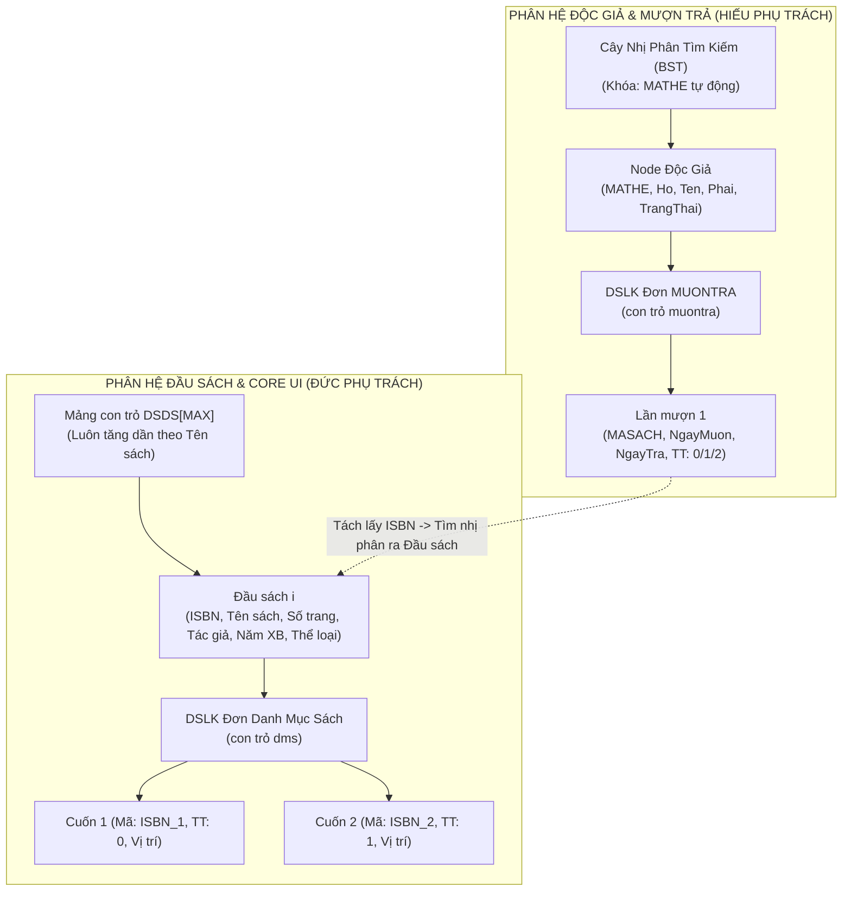
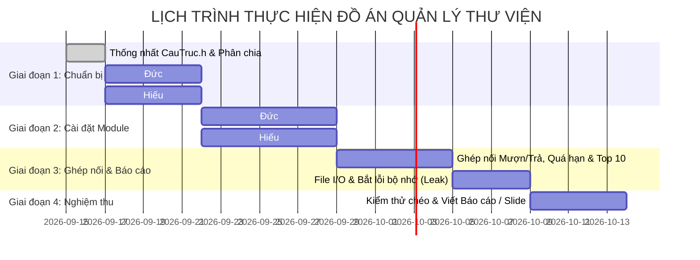

# KẾ HOẠCH PHÂN CHIA CÔNG VIỆC ĐỒ ÁN CUỐI KỲ
## MÔN: CẤU TRÚC DỮ LIỆU & GIẢI THUẬT (C++)
### ĐỀ TÀI 3: QUẢN LÝ THƯ VIỆN

---

## 1. THÔNG TIN CHUNG
- **Đề tài**: Quản lý Thư viện sách.
- **Ngôn ngữ**: C++ (Chuẩn C++11 trở lên, lập trình cấu trúc dữ liệu thuần với con trỏ và cấp phát động, không dùng thư viện container có sẵn như `std::vector`, `std::list`, `std::map` để đảm bảo chuẩn yêu cầu môn học).
- **Thành viên nhóm**:
  1. **Hiếu** (Thành viên 1 - Trưởng nhóm)
  2. **Đức** (Thành viên 2)
- **Mục tiêu**:
  - Phân chia công việc công bằng 50/50, rõ ràng ranh giới nghiệp vụ, hai bạn có thể code độc lập song song mà không bị nghẽn tiến độ.
  - Cả hai thành viên đều cài đặt các cấu trúc dữ liệu cốt lõi và nâng cao (Cây BST, Mảng con trỏ, DSLK đơn) để tự tin bảo vệ vấn đáp đạt điểm tối đa (9.5 - 10.0).

---

## 2. PHÂN TÍCH 4 CẤU TRÚC DỮ LIỆU & RÀNG BUỘC KỸ THUẬT



---

## 3. BẢNG PHÂN CHIA NHIỆM VỤ CHI TIẾT (50 / 50)
> **Quy chuẩn kiến trúc**: Cả hai thành viên đều triển khai theo mô hình **Clean Architecture & Single Responsibility Principle (SRP)**. Mỗi nhóm chức năng được tách thành một file `.cpp` riêng biệt nằm trong thư mục của phân hệ để dễ dàng kiểm thử, bảo trì và tự tin trả lời vấn đáp trực tiếp từng dòng code.

### 3.1. THÀNH VIÊN 1: HIẾU
> **Trọng tâm**: Quản lý Cây BST Độc giả, Danh sách liên kết Mượn Trả & Toàn bộ Logic Giao dịch Mượn/Trả/Quá hạn.

| STT | Hạng mục công việc | Yêu cầu kỹ thuật & Giải thuật | Sản phẩm mã nguồn (File) |
| :---: | :--- | :--- | :--- |
| **H1** | **Cơ sở Cây BST & Quản lý Bộ nhớ** | • Khởi tạo cây, kiểm tra rỗng, đếm node đệ quy.<br>• Giải phóng DSLK mượn trả & thu hồi toàn bộ cây BST theo hậu thứ tự (LRN). Chống dangling pointer. | `DocGia.h`<br>`DocGia/DocGia_Core.cpp` |
| **H2** | **Quản lý Mã thẻ & LCG chu kỳ đầy** | • Tìm kiếm theo mã thẻ O(log N).<br>• Cài đặt bộ sinh số đồng dư tuyến tính LCG (Hull-Dobell): O(1), sinh mã duy nhất, cây BST tự cân bằng tự nhiên. | `DocGia/DocGia_MaThe.cpp` |
| **H3** | **Chức năng (a) - Thêm, Sửa, Xóa Độc Giả** | • **Thêm thẻ**: Chèn node BST, bẫy trùng mã và tràn RAM.<br>• **Hiệu chỉnh**: Tìm O(log N), sửa họ tên, phái, trạng thái (bảo toàn maThe).<br>• **Xóa thẻ**: Bẫy lỗi đang mượn sách. Xóa 3 trường hợp: node lá, node 1 con, node 2 con (tìm node thế mạng nhỏ nhất bên phải, tách an toàn `dsMuonTra`). | `DocGia/DocGia_Them.cpp`<br>`DocGia/DocGia_HieuChinh.cpp`<br>`DocGia/DocGia_Xoa.cpp` |
| **H4** | **Chức năng (b) - In danh sách độc giả** | • **Chế độ 1**: In theo `maThe` tăng dần $\rightarrow$ Duyệt cây BST LNR (In-order).<br>• **Chế độ 2**: In theo Tên + Họ tăng dần $\rightarrow$ Đổ cây vào mảng con trỏ tạm, QuickSort phân hoạch Median-of-Three. | `DocGia/DocGia_In.cpp` |
| **H5** | **Cơ sở DSLK Mượn Trả** | • Khởi tạo DSLK mượn trả, kiểm tra rỗng, giải phóng danh sách. | `MuonTra.h`<br>`MuonTra/MuonTra_Core.cpp` |
| **H6** | **Chức năng (f) - Nghiệp vụ Mượn Sách** | • Bẫy 3 điều kiện tiên quyết: (1) Thẻ đang mở (`trangThai == 1`), (2) Số sách đang mượn $< 3$ cuốn, (3) Không có sách mượn quá 7 ngày.<br>• Đủ điều kiện $\rightarrow$ thêm `NodeMuonTra`, gọi API Đức cập nhật sách bên DMS sang `1` (đã mượn). | `MuonTra/MuonTra_Muon.cpp` |
| **H7** | **Chức năng (g) - Trả / Báo Mất Sách** | • Cập nhật `ngayTra = ngayHienTai`.<br>• Trả sách: `trangThai = 1`, gọi Đức đổi sách bên DMS về `0` (cho mượn).<br>• Báo mất sách: `trangThai = 2`, gọi Đức đổi sách bên DMS thành `2` (thanh lý). | `MuonTra/MuonTra_Tra.cpp` |
| **H8** | **Chức năng (h) - Liệt kê Sách Đang Mượn** | • Duyệt DSLK `dsMuonTra` lọc các node có `trangThai == 0`.<br>• Tách ISBN tra cứu tên sách từ module của Đức in ra màn hình. | `MuonTra/MuonTra_LietKe.cpp` |
| **H9** | **Chức năng (i) - Danh sách Quá Hạn** | • Duyệt toàn bộ cây BST, tìm các sách đang mượn có `(NgayHienTai - NgayMuon) > 7`.<br>• Nạp mảng tạm, sắp xếp giảm dần theo số ngày quá hạn. | `MuonTra/MuonTra_QuaHan.cpp` |
| **H10**| **Lưu trữ File Độc Giả & Mượn Trả** | • Đọc file `DocGia.txt` nạp cây BST và DSLK mượn trả.<br>• Ghi file `DocGia.txt` theo tiền thứ tự (NLR) để bảo toàn phân nhánh cây BST ban đầu khi nạp lại. | `DocGia/DocGia_File.cpp` |

---

### 3.2. THÀNH VIÊN 2: ĐỨC
> **Trọng tâm**: Quản lý Mảng con trỏ Đầu Sách, DSLK Danh Mục Sách, Thống kê Top 10, Module Ngày tháng & Xây dựng Core UI Console.

| STT | Hạng mục công việc | Yêu cầu kỹ thuật & Giải thuật | Sản phẩm mã nguồn (File) |
| :---: | :--- | :--- | :--- |
| **Đ1** | **Cơ sở Mảng Con Trỏ Đầu Sách & DMS** | • Khởi tạo mảng con trỏ `DSDS[MAX]`, kiểm tra mảng đầy/rỗng, giải phóng toàn bộ mảng con trỏ.<br>• Khởi tạo DSLK đơn `DanhMucSach`, giải phóng DSLK sách con khi xóa đầu sách. | `DauSach.h`<br>`DauSach/DauSach_Core.cpp`<br>`DanhMucSach.h`<br>`DanhMucSach/DanhMucSach_Core.cpp` |
| **Đ2** | **Chức năng (c) - Nhập Đầu Sách & Đánh Mã Tự Động** | • **Thêm đầu sách**: Nhập thông tin, chèn giữ thứ tự tăng dần theo `tenSach` (dời mảng con trỏ).<br>• **Đánh mã tự động**: Tự động sinh mã sách con dạng `[ISBN]_[STT]` (ví dụ: `IT01_1`, `IT01_2`), thêm vào DSLK DMS. | `DauSach/DauSach_Them.cpp`<br>`DanhMucSach/DanhMucSach_MaSach.cpp`<br>`DanhMucSach/DanhMucSach_Them.cpp` |
| **Đ3** | **Chức năng (d) - In Sách theo Thể Loại** | • Thu thập danh sách các thể loại duy nhất.<br>• Duyệt in theo từng thể loại, tên sách tự động tăng dần do mảng con trỏ đã có thứ tự. | `DauSach/DauSach_TheLoai.cpp` |
| **Đ4** | **Chức năng (e) - Tìm Sách & Cập nhật Trạng thái** | • Tìm kiếm theo tên sách (chính xác / gần đúng chứa chuỗi ký tự). Tìm kiếm nhị phân theo ISBN $O(\log N)$.<br>• In chi tiết các cuốn sách con trong `dms`.<br>• Hàm API cập nhật trạng thái sách (0: Cho mượn, 1: Đã mượn, 2: Thanh lý) để phân hệ Hiếu gọi. | `DauSach/DauSach_TimKiem.cpp`<br>`DanhMucSach/DanhMucSach_TrangThai.cpp` |
| **Đ5** | **Chức năng (j) - Top 10 Sách Mượn Nhiều Nhất** | • Tạo mảng thống kê tạm `{ISBN, tenSach, soLuotMuon}`.<br>• Duyệt qua toàn bộ lịch sử mượn trả của tất cả độc giả (nhận con trỏ cây từ Hiếu) $\rightarrow$ đếm tần suất mượn theo từng ISBN.<br>• Sắp xếp giảm dần theo lượt mượn (QuickSort / SelectionSort) và in ra 10 đầu sách dẫn đầu. | `DauSach/DauSach_Top10.cpp` |
| **Đ6** | **Module Xử lý Ngày Tháng (`Date`)** | • Khởi tạo struct `Date { int ngay, thang, nam; }`.<br>• Lấy ngày hiện tại hệ thống từ `<ctime>`.<br>• Kiểm tra ngày hợp lệ (năm nhuận, tháng 28/29/30/31 ngày).<br>• Tính khoảng cách số ngày giữa 2 mốc `Date` (quy về số ngày từ mốc 0 hoặc thuật toán trừ ngày) để phục vụ tính phạt quá hạn 7 ngày. | `Date.h`<br>`Date/Date_Core.cpp`<br>`Date/Date_KhoangCach.cpp` |
| **Đ7** | **Xây dựng Nền tảng UI Console Dùng Chung** | • Đồ họa console: Xóa màn hình mượt, đặt vị trí con trỏ `gotoxy`, ẩn/hiện con trỏ, vẽ khung viền (box), đổi màu chữ/nền (`SetConsoleTextAttribute`).<br>• Menu tương tác bằng phím mũi tên (`Up`, `Down`, `Enter`, `ESC`) với `_getch()`.<br>• Component hiển thị bảng phân trang (Pagination) chống tràn màn hình khi in danh sách dài. | `UI.h`<br>`UI/UI_Console.cpp`<br>`UI/UI_Menu.cpp`<br>`UI/UI_Table.cpp` |
| **Đ8** | **Lưu trữ File Đầu Sách & Danh Mục Sách** | • Đọc file `DauSach.txt` nạp mảng con trỏ đầu sách và danh sách sách con khi mở chương trình.<br>• Ghi toàn bộ mảng con trỏ và danh mục sách con vào file `DauSach.txt` khi đóng chương trình. | `DauSach/DauSach_File.cpp` |

---

## 4. GIAO ƯỚC DỮ LIỆU & KIẾN TRÚC TOÀN HỆ THỐNG (CONTRACT)

Để tránh xung đột khi code độc lập, hai bạn thống nhất cấu trúc file và thư mục chuẩn như sau:

```
Library-Management/
│
├── CauTruc.h                      # [FILE CHUNG - BẤT BIẾN] Khai báo struct và hằng số toàn cục
├── README.md                      # [CHUNG] Giới thiệu, phân công & hướng dẫn biên dịch
├── KE_HOACH_PHAN_CHIA_CONG_VIEC.md# [CHUNG] Kế hoạch chi tiết WBS & thiết kế giải thuật
├── AGENTS.md                      # [CHUNG] Quy chuẩn làm việc cho AI Agent của cả hai
├── main.cpp                       # [CHUNG] Menu tổng, điều hướng và giải phóng bộ nhớ
│
├── ── PHÂN HỆ HIẾU (ĐỘC GIẢ & MƯỢN TRẢ) ──────────────────────────────────
├── DocGia.h                       # Master Header Thẻ Độc Giả
├── DocGia/                        # Thư mục cài đặt chức năng thẻ độc giả
│   ├── DocGia_Core.cpp            # Khởi tạo, kiểm tra rỗng, đếm node, giải phóng cây BST (LRN)
│   ├── DocGia_MaThe.cpp           # Tìm kiếm mã thẻ & Bộ sinh mã tự động LCG chu kỳ đầy
│   ├── DocGia_Them.cpp            # Chèn node độc giả mới vào cây BST
│   ├── DocGia_HieuChinh.cpp       # Cập nhật thông tin độc giả (bảo toàn maThe)
│   ├── DocGia_Xoa.cpp             # Bẫy mượn sách, tìm node thế mạng, xóa node BST
│   ├── DocGia_In.cpp              # In LNR theo mã thẻ & QuickSort Median-of-Three theo tên họ
│   └── DocGia_File.cpp            # Đọc & Ghi file DocGia.txt (tiền thứ tự NLR)
├── MuonTra.h                      # Master Header Mượn Trả
├── MuonTra/                       # Thư mục cài đặt chức năng mượn trả
│   ├── MuonTra_Core.cpp           # Khởi tạo, giải phóng DSLK mượn trả
│   ├── MuonTra_Muon.cpp           # Nghiệp vụ mượn sách (kiểm tra 3 điều kiện)
│   ├── MuonTra_Tra.cpp            # Nghiệp vụ trả sách / báo mất sách
│   ├── MuonTra_LietKe.cpp         # Liệt kê sách đang mượn của độc giả
│   └── MuonTra_QuaHan.cpp         # Lọc danh sách độc giả quá hạn 7 ngày
│
├── ── PHÂN HỆ ĐỨC (ĐẦU SÁCH, DMS, UI & DATE) ─────────────────────────────
├── DauSach.h                      # Master Header Đầu Sách
├── DauSach/                       # Thư mục cài đặt chức năng đầu sách
│   ├── DauSach_Core.cpp           # Khởi tạo, giải phóng mảng con trỏ đầu sách
│   ├── DauSach_Them.cpp           # Chèn đầu sách giữ thứ tự tăng dần theo tên
│   ├── DauSach_TimKiem.cpp        # Tìm sách theo tên, tìm nhị phân theo ISBN
│   ├── DauSach_TheLoai.cpp        # Lọc danh sách đầu sách theo từng thể loại
│   ├── DauSach_Top10.cpp          # Thống kê Top 10 sách mượn nhiều nhất
│   └── DauSach_File.cpp           # Đọc & Ghi file DauSach.txt
├── DanhMucSach.h                  # Master Header Danh Mục Sách
├── DanhMucSach/                   # Thư mục cài đặt danh mục sách con
│   ├── DanhMucSach_Core.cpp       # Khởi tạo, giải phóng DSLK sách con
│   ├── DanhMucSach_MaSach.cpp     # Đánh mã sách tự động [ISBN]_[STT]
│   ├── DanhMucSach_Them.cpp       # Thêm sách con vào danh mục
│   └── DanhMucSach_TrangThai.cpp  # Cập nhật trạng thái sách (0, 1, 2)
├── Date.h                         # Master Header Module Ngày Tháng
├── Date/                          # Thư mục xử lý ngày tháng
│   ├── Date_Core.cpp              # Lấy ngày hệ thống, kiểm tra ngày hợp lệ (năm nhuận)
│   └── Date_KhoangCach.cpp        # Tính khoảng cách số ngày giữa 2 mốc Date
├── UI.h                           # Master Header Giao Diện Console
├── UI/                            # Thư mục giao diện console
│   ├── UI_Console.cpp             # Xóa màn hình, gotoxy, màu sắc, vẽ box
│   ├── UI_Menu.cpp                # Menu điều hướng bằng phím mũi tên
│   └── UI_Table.cpp               # Bảng hiển thị phân trang chống tràn
│
└── Data/                          # Thư mục chứa file dữ liệu (DocGia.txt, DauSach.txt)
```

### 4.1. Khung dữ liệu thống nhất trong `CauTruc.h`
```cpp
#pragma once

const int MAX_DAUSACH = 10000;
const int MAX_MUON_SACH = 3;
const int MAX_NGAY_MUON = 7;

// 1. Ngày tháng
struct Date {
    int ngay, thang, nam;
};

// 2. Danh mục sách (DSLK đơn)
struct DanhMucSach {
    char maSach[20];       // Ví dụ: CS101_1
    int trangThai;         // 0: Cho mượn, 1: Đã mượn, 2: Thanh lý
    char viTri[50];        // Kệ, ngăn
};

struct NodeDMS {
    DanhMucSach data;
    NodeDMS* pNext;
};

// 3. Đầu sách (Phần tử mảng con trỏ)
struct DauSach {
    char ISBN[15];
    char tenSach[100];
    int soTrang;
    char tacGia[50];
    int namXuatBan;
    char theLoai[30];
    NodeDMS* dms;          // Con trỏ trỏ đến DSLK các cuốn sách
};

struct DanhSachDauSach {
    int n;
    DauSach* nodes[MAX_DAUSACH];
};

// 4. Mượn trả (DSLK đơn)
struct MuonTra {
    char maSach[20];
    Date ngayMuon;
    Date ngayTra;
    int trangThai;         // 0: Đang mượn, 1: Đã trả, 2: Làm mất sách
};

struct NodeMuonTra {
    MuonTra data;
    NodeMuonTra* pNext;
};

// 5. Thẻ độc giả (Node Cây BST)
struct TheDocGia {
    int maThe;             // Số nguyên tự động không trùng
    char ho[50];
    char ten[20];
    char phai[5];          // "Nam" hoặc "Nu"
    int trangThai;         // 0: Khóa, 1: Đang hoạt động
    NodeMuonTra* dsMuonTra;// Con trỏ trỏ đến danh sách sách đã và đang mượn
};

struct NodeDocGia {
    TheDocGia data;
    NodeDocGia* pLeft;
    NodeDocGia* pRight;
};
typedef NodeDocGia* TREE_DocGia;
```

---

## 5. KẾ HOẠCH TIẾN ĐỘ THỰC HIỆN (ROADMAP 4 TUẦN)



### Chi tiết các mốc quan trọng (Milestones):
- **Cột mốc 1 (Cuối tuần 1)**: Xong khung dữ liệu `CauTruc.h`, khung menu console di chuyển mũi tên, và nạp được dữ liệu tĩnh test cây BST và mảng con trỏ.
- **Cột mốc 2 (Cuối tuần 2)**: Xong độc lập 2 phân hệ: Hiếu hoàn thành thêm/xóa/sửa độc giả; Đức hoàn thành thêm đầu sách, sinh mã sách tự động, lọc thể loại.
- **Cột mốc 3 (Cuối tuần 3)**: Ráp 2 phân hệ vào `main.cpp`, chạy thử quy trình mượn sách, trả sách, kiểm tra quá hạn 7 ngày, in Top 10.
- **Cột mốc 4 (Cuối tuần 4)**: Đọc ghi file hoàn chỉnh, kiểm tra không rò rỉ bộ nhớ (giải phóng toàn bộ con trỏ), hoàn thành báo cáo Word và Slide.

---

## 6. PHÂN CHIA VIẾT BÁO CÁO & BẢO VỆ VẤN ĐÁP

### 6.1. Báo cáo đồ án (File Word / PDF)
- **Đức phụ trách**:
  - Giới thiệu đề tài, phân tích bài toán.
  - Thiết kế cấu trúc dữ liệu Mảng con trỏ và Danh mục sách.
  - Thiết kế giao diện người dùng và thuật toán tìm kiếm/sắp xếp Top 10.
- **Hiếu phụ trách**:
  - Thiết kế cấu trúc dữ liệu Cây nhị phân tìm kiếm (BST) và DSLK Mượn Trả.
  - Thuật toán xóa node cây BST, thuật toán sinh mã ngẫu nhiên không trùng.
  - Phân tích luồng nghiệp vụ Mượn - Trả, ràng buộc quá hạn 7 ngày.
- **Phần chung**: Lời mở đầu, kết luận, hướng phát triển và tài liệu tham khảo.

### 6.2. Phân chia khi Thầy Cô hỏi thi (Vấn đáp)
- **Nếu thầy cô hỏi về Cây BST, xóa node 2 con, đệ quy, duyệt LNR**: $\rightarrow$ **Hiếu** đứng ra trả lời và live-code demo.
- **Nếu thầy cô hỏi về Mảng con trỏ, chèn giữ thứ tự, Binary Search, sinh mã sách**: $\rightarrow$ **Đức** đứng ra trả lời và live-code demo.
- **Nếu hỏi về File I/O, giải phóng bộ nhớ, logic mượn trả**: Cả hai đều có thể phối hợp trả lời nhịp nhàng.

---

*Kế hoạch này được lập với sự nhất trí của Hiếu và Đức. Chúc hai bạn hợp tác thuận lợi và đạt điểm 10 tuyệt đối!*
